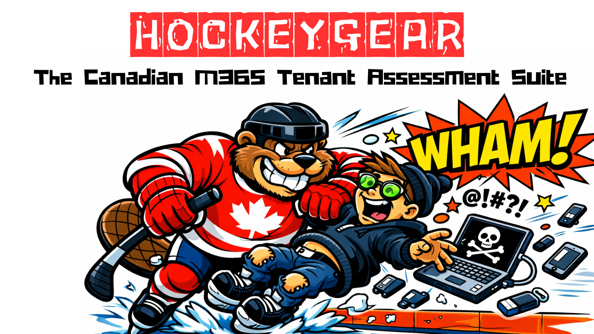

## 🏒 HockeyGear

 

## Overview
HockeyGear is a Canadian‑inspired Microsoft 365 tenant protection toolkit designed to audit, harden, and report against Government of Canada security standards. Based off @cisagov ScubaGear. 

## Features
- Tenant posture auditing
- Hardening recommendations
- Automated baseline application
- Reporting and export capabilites

## Standards Alignment
HockeyGear maps to:
- ITSG‑33 (Annex 3 & 4)
- CCCS Microsoft 365 Security Baselines
- GC Cloud Guardrails (TBS)
- NIST 800‑53 / 800‑63 mappings

## Installation
In a terminal with Git installed, enter the following: `git clone https://github.com/pryrotech.hockey-gear`

## Usage
From the repository root:
- CLI: `pwsh -NoProfile -File .\engine\engine-main.ps1`
- GUI: `pwsh -NoProfile -File .\engine\engine-main.ps1 -Gui`

Or use the root wrapper if you prefer:
- CLI: `pwsh -NoProfile -File .\HockeyGear_Main.ps1`
- GUI: `pwsh -NoProfile -File .\HockeyGear_Main.ps1 -Gui`

The GUI uses the banner image from `assets/images/hockeygear_banner.png`.

## Reporting Issues
To report any errors, please submit a detailed issue under the **"Issues"** tab and we will attempt to remediate the issue as soon as possible.

## Contributing
Pull requests welcome. Please follow coding and documentation standards.
